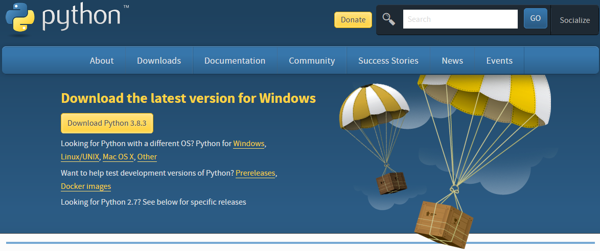
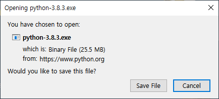

* Rev.1: 2020-05-25 (Mon)
* Draft: 2016-12-02 (Fri)
# Install Python Packages & Python3 Offline

## Install a Python package from a `.whl` file
```bash
$ pip install some-package.whl
# or
$ python -m pip install some-package.whl
```
For details, refer to:
* [How do I install a Python package with a .whl file?](https://stackoverflow.com/questions/27885397/how-do-i-install-a-python-package-with-a-whl-file)
* [How to pip install python packages offline](https://www.nyayapati.com/srao/2014/06/how-to-pip-install-python-packages-offline/)

## Install `system-site-packages` offline
### Install with `get-pip.py`
1. Download [get-pip.py](https://bootstrap.pypa.io/get-pip.py) to install `pip`.
2. Download `.whl` files for `pip`, `setuptools`, and `wheel`.
3. Move them to the target machine.
  * `get-pip.py` and the `.whl` files (`pip`, `setuptools`, `wheel`)
4. Install from local copies of `pip` and `setuptools`
```bash
$ python get-pip.py --no-index --find-links=/local/copies
```
For example,
```bash
$ ls
get-pip.py  python  python3
$ python3 get-pip.py --no-index --find-links=/home/aimldl/archive
Collecting pip
Collecting setuptools
Collecting wheel
Installing collected packages: pip, setuptools, wheel
Successfully installed pip-9.0.1 setuptools-30.0.0 wheel-0.29.0
$
```
5. Verify the installation

## Install Python3 offline
For details, refer to [How to install packages offline?](https://stackoverflow.com/questions/11091623/how-to-install-packages-offline), stackoverflow. 
### Download Python3 manually
If there is no Internet connection on your computer, one option to install Python3 is to download the installation file manually and install from it.
### Linux
1. Download the compressed file, e.g. Python-3.4.5.tgz
2. Uncompress the file
```bash
$ tar zxf Python3.4.5.tgz
```
3. cd to the `Python3` directory
4. Configure
```bash
$ ./configure
```
When configuration goes well, `Makefile` will be created in the same directory.
5. Make
```bash
$ make
```
### Windows
1. Go to https://www.python.org/downloads/.


2. Click the `Download Python x.y.z` button or select the interested release version. 


3. Run the downloaded installation file.
