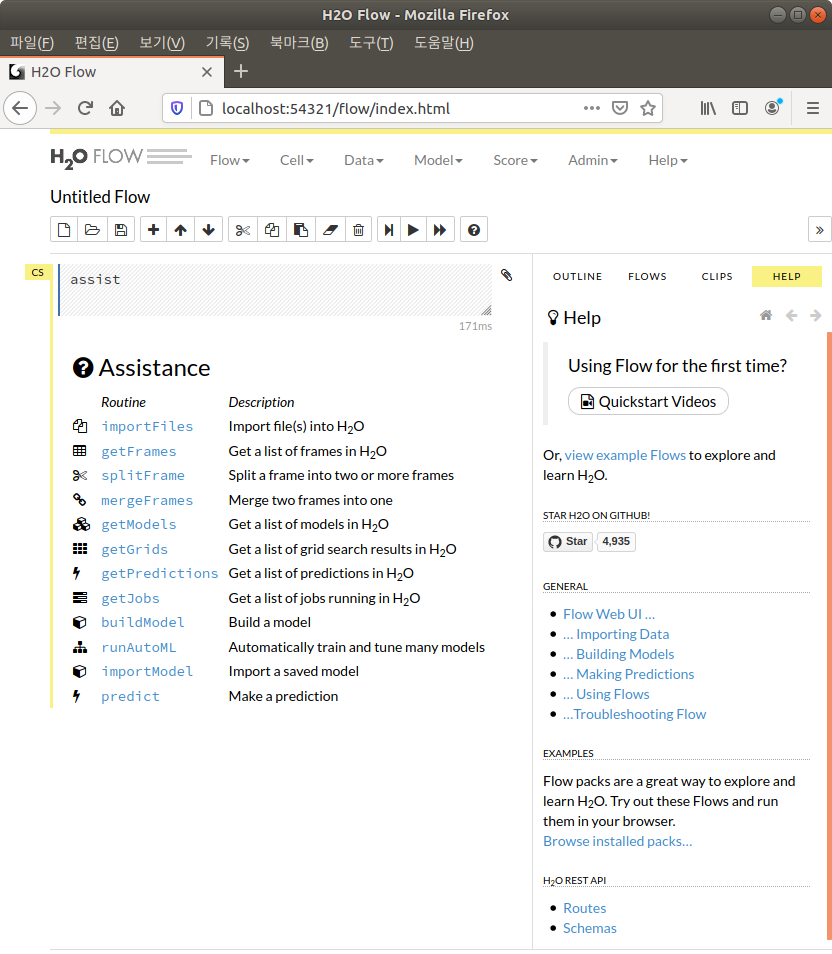

* Draft: 2020-08-11 (Tue)

# How to Install H2O on Docker
* The official installation guide does not cover this topic.
* A trick is to install H2O on an Anaconda virtual environment because the official guide covers it.

## References
* [Downloading & Installing H2O](http://docs.h2o.ai/h2o/latest-stable/h2o-docs/downloading.html) > [Install on Anaconda Cloud](http://docs.h2o.ai/h2o/latest-stable/h2o-docs/downloading.html#install-on-anaconda-cloud)
* [Using H2O with Docker](https://h2o-release.s3.amazonaws.com/h2o/rel-turing/1/docs-website/h2o-docs/docker.html), h2o.ai
  * This article covers an older version (Ubuntu 14.04, Java 7 and so on).
  * But the (older) [Dockerfile template](https://github.com/h2oai/h2o-3/blob/master/Dockerfile) and the general procesure is helpful.
* [Launching H2O with Docker](https://www.h2o.ai/blog/h2o-docker/), 2015-01-09, h2o.ai
* [Linux Docker Images](http://docs.h2o.ai/driverless-ai/latest-stable/docs/userguide/install/linux-docker-images.html), h2o.ai

## Command to install H2O on the Conda virtual environment
To install the latest H2O version, run:
```bash
$ conda install -c h2oai h2o
```

To install a specific version of H2O, run:
```bash
$ conda install -c h2oai h2o=3.30.0.6
```

## Create a Docker image with H2O
## Prerequisite
* Docker is prepared. For details, refer to [Docker Documentation](https://docs.docker.com/).

## Step 1. Prepare a Docker image with Anaconda virtual environment. 
The Docker image is available at `aimldl/baseimage_python3.7.6_conda_4.8.2_ubuntu18.04.4`.

```bash
$ sudo docker login
$ sudo docker pull aimldl/baseimage_python3.7.6_conda_4.8.2_ubuntu18.04.4
```

## Step 2. Run the Docker image to enter the container environment with Conda. 
```bash
$ sudo docker run -it aimldl/baseimage_python3.7.6_conda_4.8.2_ubuntu18.04.4 bash
2020-08-11 (Tue) 08:04 (32th week)
Welcome to ubuntu18.04, conda 4.8.2, Python 3.7.6
(base) user@fe51f813476b:~$
```

## Step 3. Install H2O with the `conda install` command.
```bash
(base) user@fe51f813476b:~$ conda install -c h2oai h2o
```

For details, refer to the official installation guide.
* [Downloading & Installing H2O](http://docs.h2o.ai/h2o/latest-stable/h2o-docs/downloading.html) > [Install on Anaconda Cloud](http://docs.h2o.ai/h2o/latest-stable/h2o-docs/downloading.html#install-on-anaconda-cloud)

The full message is below.
```bash
(base) user@fe51f813476b:~$ conda install -c h2oai h2o
Collecting package metadata (current_repodata.json): done
Solving environment: done

## Package Plan ##

  environment location: /home/user/anaconda3

  added / updated specs:
    - h2o


The following packages will be downloaded:

    package                    |            build
    ---------------------------|-----------------
    conda-4.8.3                |           py37_0         2.8 MB
    h2o-3.18.0.2               |                0       118.2 MB
    openjdk-8.0.152            |       h7b6447c_3        57.4 MB
    ------------------------------------------------------------
                                           Total:       178.4 MB

The following NEW packages will be INSTALLED:

  h2o                pkgs/main/linux-64::h2o-3.18.0.2-0
  openjdk            pkgs/main/linux-64::openjdk-8.0.152-h7b6447c_3

The following packages will be UPDATED:

  conda                                        4.8.2-py37_0 --> 4.8.3-py37_0


Proceed ([y]/n)? y

Downloading and Extracting Packages
h2o-3.18.0.2         | 118.2 MB  | ########################################################## | 100% 
conda-4.8.3          | 2.8 MB    | ########################################################## | 100% 
openjdk-8.0.152      | 57.4 MB   | ########################################################## | 100% 
Preparing transaction: done
Verifying transaction: done
Executing transaction: done
(base) user@fe51f813476b:~$ 
```

## Step 4. Verify the installation
### Step 4.1. Run the Docker container with an image with H2O
H2O must be executed in the Docker container environment. So run a container from the prepared Docker image.

```bash
$ sudo docker run -it -p 54321:54321 <image_name>
```
Note `-p 54321:54321` mathces port 54321 inside the container to port 54321 outside the container while H2O Flow requires to use port 54321. 

When the image name of the prepared Docker Image is `aimldl/baseimage_h2o3.18.0.2_openjdk8.0.152_python3.7.6_conda4.8.3_ubuntu18.04.5`, run:

```bash
$ sudo docker run -it -p 54321:54321 aimldl/baseimage_h2o3.18.0.2_openjdk8.0.152_python3.7.6_conda4.8.3_ubuntu18.04.5
[sudo] h2o_docker의 암호: 
2020-08-12 (Wed) 04:22 (32th week)
Welcome to ubuntu18.04, conda 4.8.3, Python 3.7.6
(base) user@660e69cd5772:~$
```
The prompt `(base) user@660e69cd5772:~$` indicates the terminal is INSIDE the Docker container.

## Step 4.2. Run H2O Flow
The previously installed H2O is at `~/anaconda3/h2o_jar/h2o.jar`. To start H2O Flow, run:

```bash
(base) user@f07c7b8d5897:~$ java -jar ~/anaconda3/h2o_jar/h2o.jar
08-12 02:10:48.813 172.17.0.2:54321      54     main      INFO: Found XGBoost backend with library: xgboost4j_gpu
08-12 02:10:48.820 172.17.0.2:54321      54     main      INFO: XGBoost supported backends: [WITH_GPU, WITH_OMP]
08-12 02:10:48.820 172.17.0.2:54321      54     main      INFO: ----- H2O started  -----
  ...
```

Alternatively, go to the directory where `h2o.jar` is located and run the `.jar` file.

```bash
(base) user@f07c7b8d5897:~$ cd anaconda3/h2o_jar/
(base) user@f07c7b8d5897:~/anaconda3/h2o_jar$ ls
h2o.jar
(base) user@f07c7b8d5897:~/anaconda3/h2o_jar$ java -jar h2o.jar
```

## Step 4.3. Enter the following address on a web browser.
Outside the container environment, open a web browser. You may click an icon:


In the web browser, enter:

> http://localhost:54321

and H2O Flow starts like this

 

Notice the URL is automatically changed to

> http://localhost:54321/flow/index.html

### Moving out of the container without killing it (in the terminal)
To do Step 4.3, you may leave the terminal as it is and use a web browser.
(On Ubuntu Linux, you may click the icon of the default web browser Mozilla.)


Optionally, it is good to know how to mow out ot the container environment without killing it in the terminal.

In the Docker container prompt, press `Ctrl+p+q`. That's it.
```bash
(base) user@f07c7b8d5897:~/anaconda3/h2o_jar$ 
```
Notice the prompt has moved out of the container.
```bash
 aimldl@Home-Laptop:~$
 ```
 To double-check the container is still up and running, use the `docker ps` command.
 ```bash
aimldl@Home-Laptop:~$ sudo docker ps
CONTAINER ID  IMAGE                                                                             ...  PORTS                     NAMES
660e69cd5772  aimldl/baseimage_h2o3.18.0.2_openjdk8.0.152_python3.7.6_conda4.8.3_ubuntu18.04.5  ...  0.0.0.0:54321->54321/tcp  heuristic_black
$
```
Notice 
* the image `aimldl/baseimage_h2o3.18.0.2_openjdk8.0.152_python3.7.6_conda4.8.3_ubuntu18.04.5` is running as a container.
  * Name: heuristic_black
  * ID: 660e69cd5772
* the port `0.0.0.0:54321` is mapped to `54321/tcp`.

## Appendix. The full output message to run H2O Flow

```bash
(base) user@f07c7b8d5897:~/anaconda3/h2o_jar$ java -jar h2o.jar
08-12 02:10:48.813 172.17.0.2:54321      54     main      INFO: Found XGBoost backend with library: xgboost4j_gpu
08-12 02:10:48.820 172.17.0.2:54321      54     main      INFO: XGBoost supported backends: [WITH_GPU, WITH_OMP]
08-12 02:10:48.820 172.17.0.2:54321      54     main      INFO: ----- H2O started  -----
08-12 02:10:48.821 172.17.0.2:54321      54     main      INFO: Build git branch: (HEAD detached from jenkins-3.18.0.2)
08-12 02:10:48.821 172.17.0.2:54321      54     main      INFO: Build git hash: 2be3e89d3c3af3a5fe8d66bf19fcf2ac51453033
08-12 02:10:48.821 172.17.0.2:54321      54     main      INFO: Build git describe: jenkins-3.18.0.2-3-g2be3e89d3c
08-12 02:10:48.821 172.17.0.2:54321      54     main      INFO: Build project version: 3.18.0.2 (latest version: 3.30.1.1)
08-12 02:10:48.821 172.17.0.2:54321      54     main      INFO: Build age: 2 years, 5 months and 6 days
08-12 02:10:48.821 172.17.0.2:54321      54     main      INFO: Built by: 'root'
08-12 02:10:48.821 172.17.0.2:54321      54     main      INFO: Built on: '2018-03-05 19:37:43'
08-12 02:10:48.821 172.17.0.2:54321      54     main      INFO: 
08-12 02:10:48.821 172.17.0.2:54321      54     main      INFO: *** Your H2O version is too old! Please download the latest version 3.30.1.1 from http://h2o.ai/download/ ***
08-12 02:10:48.821 172.17.0.2:54321      54     main      INFO: 
08-12 02:10:48.821 172.17.0.2:54321      54     main      INFO: Watchdog Build git branch: (unknown)
08-12 02:10:48.821 172.17.0.2:54321      54     main      INFO: Watchdog Build git hash: (unknown)
08-12 02:10:48.821 172.17.0.2:54321      54     main      INFO: Watchdog Build git describe: (unknown)
08-12 02:10:48.821 172.17.0.2:54321      54     main      INFO: Watchdog Build project version: (unknown)[TODO
08-12 02:10:48.822 172.17.0.2:54321      54     main      INFO: Watchdog Built by: (unknown)
08-12 02:10:48.822 172.17.0.2:54321      54     main      INFO: Watchdog Built on: (unknown)
08-12 02:10:48.822 172.17.0.2:54321      54     main      INFO: XGBoost Build git branch: (unknown)
08-12 02:10:48.822 172.17.0.2:54321      54     main      INFO: XGBoost Build git hash: (unknown)
08-12 02:10:48.822 172.17.0.2:54321      54     main      INFO: XGBoost Build git describe: (unknown)
08-12 02:10:48.822 172.17.0.2:54321      54     main      INFO: XGBoost Build project version: (unknown)
08-12 02:10:48.822 172.17.0.2:54321      54     main      INFO: XGBoost Built by: (unknown)
08-12 02:10:48.822 172.17.0.2:54321      54     main      INFO: XGBoost Built on: (unknown)
08-12 02:10:48.822 172.17.0.2:54321      54     main      INFO: KrbStandalone Build git branch: (unknown)
08-12 02:10:48.822 172.17.0.2:54321      54     main      INFO: KrbStandalone Build git hash: (unknown)
08-12 02:10:48.822 172.17.0.2:54321      54     main      INFO: KrbStandalone Build git describe: (unknown)
08-12 02:10:48.822 172.17.0.2:54321      54     main      INFO: KrbStandalone Build project version: (unknown)
08-12 02:10:48.822 172.17.0.2:54321      54     main      INFO: KrbStandalone Built by: (unknown)
08-12 02:10:48.822 172.17.0.2:54321      54     main      INFO: KrbStandalone Built on: (unknown)
08-12 02:10:48.823 172.17.0.2:54321      54     main      INFO: Processed H2O arguments: []
08-12 02:10:48.823 172.17.0.2:54321      54     main      INFO: Java availableProcessors: 8
08-12 02:10:48.823 172.17.0.2:54321      54     main      INFO: Java heap totalMemory: 481.5 MB
08-12 02:10:48.823 172.17.0.2:54321      54     main      INFO: Java heap maxMemory: 6.96 GB
08-12 02:10:48.823 172.17.0.2:54321      54     main      INFO: Java version: Java 1.8.0_152-release (from JetBrains s.r.o)
08-12 02:10:48.823 172.17.0.2:54321      54     main      INFO: JVM launch parameters: []
08-12 02:10:48.823 172.17.0.2:54321      54     main      INFO: OS version: Linux 4.15.0-112-generic (amd64)
08-12 02:10:48.823 172.17.0.2:54321      54     main      INFO: Machine physical memory: 31.32 GB
08-12 02:10:48.823 172.17.0.2:54321      54     main      INFO: X-h2o-cluster-id: 1597198247193
08-12 02:10:48.823 172.17.0.2:54321      54     main      INFO: User name: 'user'
08-12 02:10:48.823 172.17.0.2:54321      54     main      INFO: IPv6 stack selected: false
08-12 02:10:48.823 172.17.0.2:54321      54     main      INFO: Possible IP Address: eth0 (eth0), 172.17.0.2
08-12 02:10:48.823 172.17.0.2:54321      54     main      INFO: Possible IP Address: lo (lo), 127.0.0.1
08-12 02:10:48.824 172.17.0.2:54321      54     main      INFO: H2O node running in unencrypted mode.
08-12 02:10:48.825 172.17.0.2:54321      54     main      INFO: Internal communication uses port: 54322
08-12 02:10:48.825 172.17.0.2:54321      54     main      INFO: Listening for HTTP and REST traffic on http://172.17.0.2:54321/
08-12 02:10:48.825 172.17.0.2:54321      54     main      INFO: H2O cloud name: 'user' on /172.17.0.2:54321, discovery address /225.54.235.203:57654
08-12 02:10:48.825 172.17.0.2:54321      54     main      INFO: If you have trouble connecting, try SSH tunneling from your local machine (e.g., via port 55555):
08-12 02:10:48.825 172.17.0.2:54321      54     main      INFO:   1. Open a terminal and run 'ssh -L 55555:localhost:54321 user@172.17.0.2'
08-12 02:10:48.825 172.17.0.2:54321      54     main      INFO:   2. Point your browser to http://localhost:55555
08-12 02:10:48.924 172.17.0.2:54321      54     main      INFO: Log dir: '/tmp/h2o-user/h2ologs'
08-12 02:10:48.924 172.17.0.2:54321      54     main      INFO: Cur dir: '/home/user/anaconda3/h2o_jar'
08-12 02:10:48.927 172.17.0.2:54321      54     main      INFO: HDFS subsystem successfully initialized
08-12 02:10:48.929 172.17.0.2:54321      54     main      INFO: S3 subsystem successfully initialized
08-12 02:10:48.929 172.17.0.2:54321      54     main      INFO: Flow dir: '/home/user/h2oflows'
08-12 02:10:48.938 172.17.0.2:54321      54     main      INFO: Cloud of size 1 formed [/172.17.0.2:54321]
08-12 02:10:48.943 172.17.0.2:54321      54     main      INFO: Registered parsers: [GUESS, ARFF, XLS, SVMLight, AVRO, PARQUET, CSV]
08-12 02:10:48.943 172.17.0.2:54321      54     main      INFO: Watchdog extension initialized
08-12 02:10:48.943 172.17.0.2:54321      54     main      INFO: XGBoost extension initialized
08-12 02:10:48.943 172.17.0.2:54321      54     main      INFO: KrbStandalone extension initialized
08-12 02:10:48.943 172.17.0.2:54321      54     main      INFO: Registered 3 core extensions in: 169ms
08-12 02:10:48.943 172.17.0.2:54321      54     main      INFO: Registered H2O core extensions: [Watchdog, XGBoost, KrbStandalone]
08-12 02:10:49.088 172.17.0.2:54321      54     main      INFO: Registered: 165 REST APIs in: 145ms
08-12 02:10:49.088 172.17.0.2:54321      54     main      INFO: Registered REST API extensions: [XGBoost, Algos, AutoML, Core V3, Core V4]
08-12 02:10:49.190 172.17.0.2:54321      54     main      INFO: Registered: 233 schemas in 102ms
08-12 02:10:49.191 172.17.0.2:54321      54     main      INFO: H2O started in 1992ms
08-12 02:10:49.191 172.17.0.2:54321      54     main      INFO: 
08-12 02:10:49.191 172.17.0.2:54321      54     main      INFO: Open H2O Flow in your web browser: http://172.17.0.2:54321
08-12 02:10:49.191 172.17.0.2:54321      54     main      INFO: 
08-12 02:13:21.859 172.17.0.2:54321      54     #73041-15 INFO: GET /, parms: {}
08-12 02:13:21.862 172.17.0.2:54321      54     #73041-15 INFO: GET /flow/index.html, parms: {}
08-12 02:13:22.198 172.17.0.2:54321      54     #73041-14 INFO: GET /flow/fonts/fontawesome-webfont.woff, parms: {v=4.2.0}
08-12 02:13:22.222 172.17.0.2:54321      54     #73041-14 INFO: GET /flow/index.html, parms: {}
08-12 02:13:22.227 172.17.0.2:54321      54     #73041-14 INFO: GET /3/Metadata/endpoints, parms: {}
08-12 02:13:22.230 172.17.0.2:54321      54     #73041-14 INFO: Locking cloud to new members, because hex.schemas.XGBoostV3
08-12 02:13:22.416 172.17.0.2:54321      54     #73041-14 INFO: GET /3/NodePersistentStorage/notebook, parms: {}
08-12 02:13:22.416 172.17.0.2:54321      54     #73041-18 INFO: GET /3/NodePersistentStorage/categories/environment/names/clips/exists, parms: {}
08-12 02:13:22.418 172.17.0.2:54321      54     #73041-16 INFO: GET /flow/help/catalog.json, parms: {}
08-12 02:13:22.420 172.17.0.2:54321      54     #73041-16 INFO: GET /3/About, parms: {}
08-12 02:13:22.422 172.17.0.2:54321      54     #73041-17 INFO: GET /3/ModelBuilders, parms: {}
08-12 02:14:06.723 172.17.0.2:54321      54     #73041-19 INFO: GET /flow/index.html, parms: {}
08-12 02:14:07.172 172.17.0.2:54321      54     #73041-50 INFO: GET /flow/index.html, parms: {}
08-12 02:14:07.177 172.17.0.2:54321      54     #73041-50 INFO: GET /3/Metadata/endpoints, parms: {}
08-12 02:14:07.281 172.17.0.2:54321      54     #73041-50 INFO: GET /3/NodePersistentStorage/notebook, parms: {}
08-12 02:14:07.283 172.17.0.2:54321      54     #73041-51 INFO: GET /3/NodePersistentStorage/categories/environment/names/clips/exists, parms: {}
08-12 02:14:07.284 172.17.0.2:54321      54     #73041-50 INFO: GET /flow/help/catalog.json, parms: {}
08-12 02:14:07.285 172.17.0.2:54321      54     #73041-51 INFO: GET /3/About, parms: {}
08-12 02:14:07.287 172.17.0.2:54321      54     #73041-50 INFO: GET /3/ModelBuilders, parms: {}
08-12 02:14:07.792 172.17.0.2:54321      54     #73041-50 INFO: GET /flow/fonts/fontawesome-webfont.woff, parms: {v=4.2.0}
```
