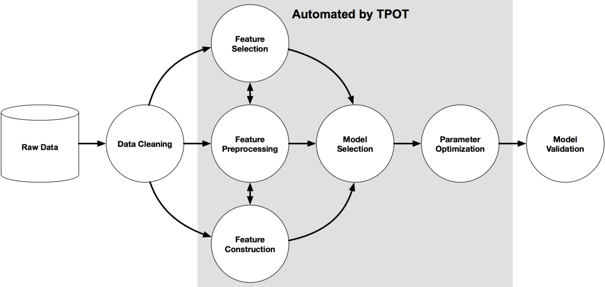

* Draft: 2020-06-09 (Tue)

# TPOT

* TPOT is a Python library for automated machine learning (autoML) which does feature engineering, model selection and hyperparameter optimization/tuning for you.

* It considers:

  * multiple data preprocessing steps: missing value imputation, scaling
  * multiple feature engineering steps: PCA, feature selection, etc.
  * multiple ML algorithms: Random Forests, SVMs, Linear Models, etc.
  * multiple hyperparameters for all of the previous steps:
  * multiple ways to ensemble or stack the ML algorithms within the pipeline.

  For details, refer to [TPOT Docs > Using TPOT > What to expect from AutoML software](http://epistasislab.github.io/tpot/using/).

* Developed by researchers at University of Pennsylvania

* Note
  * TPOT doesn't automate the data preparation part, e.g. data cleansing.
  * TPOT doesn't automate deep learning (autoDL). Refer to something like AutoKeras.

## Automated Machine Learning (AutoML)

AutoML automates the machine learning workflow. It's an "Data Science Assistant" to help you find strong baseline models. It is not meant to replace human data scientist yet because human expert can do a better job than autoML.



Source: [An example machine learning pipeline](http://epistasislab.github.io/tpot/)

TPOT is built on scikit-learn, a popular machine learning package. It works like a wrapper around sckit-learn that sets various combinations of features, algorithms, and hyperparameters.

## TPOT finds the best combination of design parameters with evolutionary algorithm

There are a number of design parameters to run an "episode" of experiment. Selections of feature engineering, an algorithm (classifier or regressor), and the hyperparameters of the algorithm are the design parameters.

TPOT uses a genetic search algorithm, specifically evolutionary algorithm (EA), to explore these design parameters. For example, TPOT tries a ML pipeline and evaluates its performance. There are a population of ML pipelines and the best performing pipeline gets selected for this generation. For the next generation, parts of the pipelines are changed and the new population of pipelines are evaluated to select the the best pipeline. In other words, EA selects the fittest (pipeline). Through survival of the fittest, EA searches the design parameters and finds the best combination or pipeline.

In sum, this natural selection is the key idea behind EA which is applied to the ML workflow. As a result, TPOT works like a "Data Science Assistant" that searches the possible combinations automatically and creates Python scripts to run the best pipeline. 

## TPOT creates Python scripts to run the best pipelines

Checkpoints! TPOT allows to save a checkpoint which is a Python script for the best pipeline up to that moment. So multiple Python scripts are automatically generated at each checkpoint. **You can simply choose the best pipeline as your strong baseline model and start from there. The Python script is generated automatically. It's quite convenient!**

Under the `checkpoint` directory, `pipeline_gen*.py` is generated at each checkpoint.

```bash
$ tree tpot_with_openml_datsets/
tpot_with_openml_datsets/
├── README.md
├── checkpoint
│   ├── pipeline_gen_14_idx_1_2020.06.12_03-49-52.py
          ...
│   └── pipeline_gen_8_idx_0_2020.06.11_20-01-17.py
├── df_tpot_result.csv
├── requirements.txt
├── test_2020-06-11_18-11.log
└── main_tpot_with_openml_datsets.py

1 directory, 15 files
$
```

One of the `pipeline_gen*.py` is below.

```python
import numpy as np
import pandas as pd
from sklearn.model_selection import train_test_split
from sklearn.naive_bayes import BernoulliNB
from sklearn.pipeline import make_pipeline, make_union
from tpot.builtins import StackingEstimator
from xgboost import XGBClassifier

# NOTE: Make sure that the outcome column is labeled 'target' in the data file
tpot_data = pd.read_csv('PATH/TO/DATA/FILE', sep='COLUMN_SEPARATOR', dtype=np.float64)
features = tpot_data.drop('target', axis=1)
training_features, testing_features, training_target, testing_target = \
            train_test_split(features, tpot_data['target'], random_state=None)

# Average CV score on the training set was: 0.9089007348798539
exported_pipeline = make_pipeline(
    StackingEstimator(estimator=BernoulliNB(alpha=10.0, fit_prior=False)),
    XGBClassifier(learning_rate=0.1, max_depth=6, min_child_weight=1, n_estimators=100, nthread=1, subsample=0.6000000000000001)
)

exported_pipeline.fit(training_features, training_target)
results = exported_pipeline.predict(testing_features)
```

For details, refer to [Run a strong baseline model from TPOT](how_to/run_strong_baseline_model_from_tpot.md).

-----------

Next:

* [Supported Classifiers](docs/supported_classifiers.md)

## References

* [TPOT Automated Machine Learning in Python](https://towardsdatascience.com/tpot-automated-machine-learning-in-python-4c063b3e5de9), 2018-08-22, Jeff Hale
* TPOT > Docs > Using TPOT > [What to expect from AutoML software](https://epistasislab.github.io/tpot/using/)

* [TPOT API](https://epistasislab.github.io/tpot/api/)