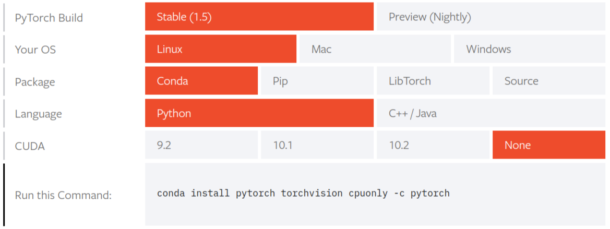
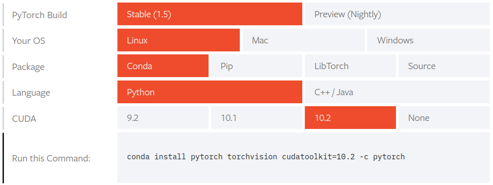

* Draft: 2020-06-09 (Tue)

# Install TPOT


```bash
(base) $ conda create -n tpot python=3 anaconda
(base) $ conda activate tpot                   
(tpot) $ 
```

TPOT is installed using either `pip` or `conda-forge`. The latter is used in this example. For details, refer to [TPOT > Docs > Installation](https://epistasislab.github.io/tpot/installing/).

```bash
$ conda install -c conda-forge tpot xgboost dask dask-ml scikit-mdr skrebate
  ...
## Package Plan ##

  environment location: /home/user/anaconda3/envs/tpot

  added / updated specs:
    - dask
    - dask-ml
    - scikit-mdr
    - skrebate
    - tpot
    - xgboost


The following packages will be downloaded:

    package                    |            build
    ---------------------------|-----------------
    _py-xgboost-mutex-2.0      |            cpu_0           8 KB  conda-forge
    ca-certificates-2020.4.5.2 |       hecda079_0         147 KB  conda-forge
    certifi-2020.4.5.2         |   py38h32f6830_0         152 KB  conda-forge
    dask-glm-0.2.0             |             py_1          14 KB  conda-forge
    dask-ml-1.4.0              |             py_0         104 KB
    deap-1.3.1                 |   py38hcb8c335_1         153 KB  conda-forge
    libxgboost-1.0.2           |       he1b5a44_1         2.8 MB  conda-forge
    openssl-1.1.1g             |       h516909a_0         2.1 MB  conda-forge
    py-xgboost-1.0.2           |   py38h32f6830_1         2.2 MB  conda-forge
    python_abi-3.8             |           1_cp38           4 KB  conda-forge
    scikit-mdr-0.4.4           |             py_1          12 KB  conda-forge
    skrebate-0.6               |             py_0          19 KB  conda-forge
    stopit-1.1.2               |             py_0          16 KB  conda-forge
    tpot-0.11.5                |     pyh9f0ad1d_0          80 KB  conda-forge
    update_checker-0.17        |     pyh9f0ad1d_0          10 KB  conda-forge
    xgboost-1.0.2              |   py38h950e882_1          11 KB  conda-forge
    ------------------------------------------------------------
                                           Total:         7.9 MB
  ...
$
```

Installation XGBoost is optional.

> **Optionally**, you can install [XGBoost](https://github.com/dmlc/xgboost) if you would like TPOT to use the eXtreme Gradient Boosting models. XGBoost is entirely optional, and TPOT will still function normally without XGBoost if you do not have it installed.


### Verification

```bash
$ python -c "import tpot; print(tpot.__version__)"
0.11.5
$
```


## TPOT-NN

To install PyTorch-based neural networks, PyTorch is installed. For details, refer to [PyTorch > GET STARTED] (https://pytorch.org/get-started/locally/).

> #### No CUDA
>
> To install PyTorch via Anaconda, and do not have a [CUDA-capable](https://developer.nvidia.com/cuda-zone) system or do not require CUDA, in the above selector, choose OS: Linux, Package: Conda and CUDA: None. Then, run the command that is presented to you.



```bash
$ conda install pytorch torchvision cpuonly -c pytorch
  ...
The following packages will be downloaded:

    package                    |            build
    ---------------------------|-----------------
    cpuonly-1.0                |                0           2 KB  pytorch
    ninja-1.9.0                |   py38hfd86e86_0         1.2 MB
    pytorch-1.5.0              |      py3.8_cpu_0        90.5 MB  pytorch
    torchvision-0.6.0          |         py38_cpu        11.0 MB  pytorch
    ------------------------------------------------------------
                                           Total:       102.7 MB
  ...
$
```

> #### With CUDA
>
> To install PyTorch via Anaconda, and you do have a [CUDA-capable](https://developer.nvidia.com/cuda-zone) system, in the above selector, choose OS: Linux, Package: Conda and the CUDA version suited to your machine. Often, the latest CUDA version is better. Then, run the command that is presented to you.



### Verification

```bash
$ python -c "import torch; print(torch.__version__)"
1.5.0
$
```

#### No CUDA

```bash
$ python -c "from __future__ import print_function; import torch; print( torch.rand(5,3))"
```

```bash
tensor([[0.6054, 0.8346, 0.5884],
        [0.7670, 0.0182, 0.1556],
        [0.5061, 0.6059, 0.2190],
        [0.2671, 0.6239, 0.8459],
        [0.8830, 0.9563, 0.1210]])
$
```

The above command runs the following Python script in the command line.

```python
from __future__ import print_function
import torch
x = torch.rand(5, 3)
print(x)
```

#### With CUDA

```python
import torch
torch.cuda.is_available()
```


## Creating a Docker Image

Up to this point, the installation can be done with and without a Docker container.

* You may create a Conda virtual environment `tpot` and install everything inside the environment.
* If this is done inside a Docker container, 

```bash
# Inside a Docker container
  ...
(tpot) $ read escape sequence
$ docker ps
CONTAINER ID  IMAGE                                                   COMMAND  ...  NAMES
0ea970718c74  aimldl/baseimage_python3.7.6_conda_4.8.2_ubuntu18.04.4  "bash"  ...  cool_visvesvaraya
$
```

this container can be committed to create a Docker image as follows:

```bash
$ docker commit 0ea970718c74 aimldl/baseimage_tpot0.11.5_xgboost1.0.2_pytorch1.5.0_python3.7.6_conda_4.8.3_ubuntu18.04
sha256:555ad8b113741f716b610ed488da7c6f6c9834d4ae4780725f98ed3922ce7641
$
```

Upload the created image to Docker Hub.

```bash
$ docker login
$ docker push aimldl/baseimage_tpot0.11.5_xgboost1.0.2_pytorch1.5.0_python3.7.6_conda_4.8.3_ubuntu18.04
$
```

