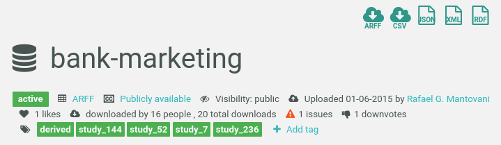

* Draft: 2020-06-12 (Fri)

# Run a Strong Baseline Model from TPOT

The same dataset is downloaded from openml.com

https://www.openml.org/d/1558

bank-marketing




`phpBwZPTw.csv` is downloaded.

The file name of the checkpoint file with the strong baseline model `pipeline_gen_8_idx_0_2020.06.11_20-01-17.py` is changed to `main_strong_baseline_from_tpot.py`.

```bash
$ ls
main_strong_baseline_from_tpot.py  phpBwZPTw.csv
$
```

```bash
$ docker run -it -v /home/aimldl:/home/user/projects aimldl/baseimage_excode_tpot0.11.5_xgboost1.0.2_pytorch1.5.0_python3.7.6_conda4.8.3_ubuntu18.04 bash
2020-06-12 (Fri) 09:14 (23th week)
Welcome to ubuntu18.04, conda 4.8.3, Python 3.7.6
(base) user@4587ab443f9c:~$ ls
anaconda3  bin  hands-ons  history.log  projects
(base) user@4587ab443f9c:~$ cd projects/
(base) user@4587ab443f9c:~/projects$ ls
main_strong_baseline_from_tpot.py  phpBwZPTw.csv
(base) user@4587ab443f9c:~/projects$ conda activate tpot
(tpot) user@4587ab443f9c:~/projects$ 
```

An error occured! TODO: Fix this.

```bash
python main_strong_baseline_from_tpot.py 
main_strong_baseline_from_tpot.py:11: ParserWarning: Falling back to the 'python' engine because the 'c' engine does not support regex separators (separators > 1 char and different from '\s+' are interpreted as regex); you can avoid this warning by specifying engine='python'.
  tpot_data = pd.read_csv('phpBwZPTw.csv', sep='COLUMN_SEPARATOR', dtype=np.float64)
Traceback (most recent call last):
  File "/home/user/anaconda3/envs/tpot/lib/python3.8/site-packages/pandas/io/parsers.py", line 1835, in _cast_types
    values = astype_nansafe(values, cast_type, copy=True, skipna=True)
  File "/home/user/anaconda3/envs/tpot/lib/python3.8/site-packages/pandas/core/dtypes/cast.py", line 897, in astype_nansafe
    return arr.astype(dtype, copy=True)
ValueError: could not convert string to float: '30,unemployed,married,primary,no,1787,no,no,cellular,19,oct,79,1,-1,0,unknown,1'

During handling of the above exception, another exception occurred:

Traceback (most recent call last):
  File "main_strong_baseline_from_tpot.py", line 11, in <module>
    tpot_data = pd.read_csv('phpBwZPTw.csv', sep='COLUMN_SEPARATOR', dtype=np.float64)
  File "/home/user/anaconda3/envs/tpot/lib/python3.8/site-packages/pandas/io/parsers.py", line 676, in parser_f
    return _read(filepath_or_buffer, kwds)
  File "/home/user/anaconda3/envs/tpot/lib/python3.8/site-packages/pandas/io/parsers.py", line 454, in _read
    data = parser.read(nrows)
  File "/home/user/anaconda3/envs/tpot/lib/python3.8/site-packages/pandas/io/parsers.py", line 1133, in read
    ret = self._engine.read(nrows)
  File "/home/user/anaconda3/envs/tpot/lib/python3.8/site-packages/pandas/io/parsers.py", line 2464, in read
    data = self._convert_data(data)
  File "/home/user/anaconda3/envs/tpot/lib/python3.8/site-packages/pandas/io/parsers.py", line 2528, in _convert_data
    return self._convert_to_ndarrays(
  File "/home/user/anaconda3/envs/tpot/lib/python3.8/site-packages/pandas/io/parsers.py", line 1727, in _convert_to_ndarrays
    cvals = self._cast_types(cvals, cast_type, c)
  File "/home/user/anaconda3/envs/tpot/lib/python3.8/site-packages/pandas/io/parsers.py", line 1837, in _cast_types
    raise ValueError(
ValueError: Unable to convert column "V1","V2","V3","V4","V5","V6","V7","V8","V9","V10","V11","V12","V13","V14","V15","V16","Class" to type <class 'numpy.float64'>
$ 

```

