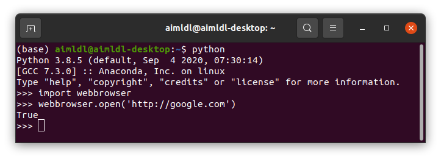

* Draft: 2021-01-06 (Wed)

# webbrowser

기본 웹브라우저를 자동으로 실행하는 모듈입니다.

## 웹브라우저를 열어서, 구글 홈페이지로 이동하는 예

다음 프로그램으로 웹브라우저를 엽니다.

```python
import webbrowser
url = 'http://google.com'
webbrowser.open(url)
```



`True`를 리턴하면서, 아래처럼 기본 웹브라우저가 자동 실행되고, 구글 홈페이지 `http://google.com로 이동했습니다. 열린 웹브라우저의 화면입니다.

